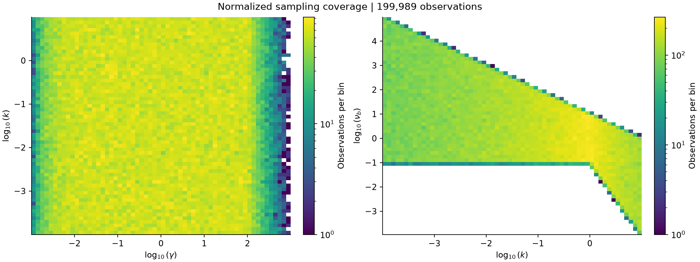
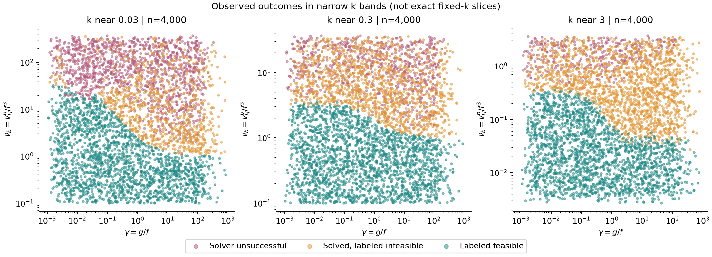

# Normalized data audit

Completed 2026-09-06 for T02, using conda `debbirth`.

## Decision

Reuse the supplied splits for initial normalized and critical-boundary classification experiments. Normalization preserves all 199,989 rows as distinct observations and does not introduce duplicate leakage between splits. There is no evidence here that a replacement simulation dataset is needed before model development. Defer T11 and proceed to T03.

This is a data-integrity and coverage assessment, not independent validation of the critical-boundary derivation or the solver labels. The binary labels support training a boundary classifier; they are not direct regression targets for `Psi`.

**Application-policy clarification (2026-09-06):** the user intentionally treats solver timeouts/nonconvergence as infeasible for practical screening. The diagnostics below describe that target, not a request to recover feasible cases with another solver or clean their labels. The numerical-reference project previously proposed as T07 has been replaced by analytical-contract/implementation work; the historical audit measurements remain unchanged.

## Reproduce and inspect

From the repository root:

```powershell
conda run -n debbirth python experiments/audit_normalized_data.py
```

The [audit script](../experiments/audit_normalized_data.py) reads the raw LHS data, combined processed data, and three splits without modifying them. It writes derived outputs to `results/runs/normalized_data_audit/`, including a row-provenance CSV mapping every split observation to its processed and raw record. That directory is ignored by Git. In this session, source-data access required execution outside the sandbox.

Small snapshots are retained beside this report:

- [Summary and source SHA-256 hashes](data_audit/summary.json), including runtime versions, the audit script hash, matching tolerances, duplicate counts, and coverage statistics.
- [Split summary](data_audit/split_summary.csv), [parameter ranges](data_audit/ranges.csv), and [maintenance regimes](data_audit/regimes.csv).
- [Solver diagnostics](data_audit/diagnostics.csv) and [error-message consistency](data_audit/error_diagnostics.csv).
- Coverage and observed-outcome figures below.

To refresh these snapshots after intentionally rerunning the audit, copy the corresponding small JSON/CSV/PNG outputs from the run directory to `docs/data_audit/`. Keep the full row-provenance output in the run directory rather than versioning another large dataset.

## Row counts and provenance

The raw file contains 200,000 records. Applying the preprocessing notebook's positive-execution-time and finite-parameter filters retains 199,989. All 11 exclusions have nonpositive execution time; one also has invalid/nonpositive parameters. All retained split inputs are finite and strictly positive, and their execution times are positive.

| Split | Rows | Feasible labels | Feasible fraction | Unsuccessful solver rows | Recorded timeouts |
| --- | ---: | ---: | ---: | ---: | ---: |
| Train | 159,991 | 67,635 | 42.2743% | 52,749 | 484 |
| Validation | 19,999 | 8,455 | 42.2771% | 6,554 | 57 |
| Test | 19,999 | 8,454 | 42.2721% | 6,624 | 65 |
| Total | 199,989 | 84,544 | 42.2743% | 65,927 | 606 |

The combined splits map bijectively to the processed file with exact equality of the parsed original parameters. The processed file maps bijectively to the eligible raw records, allowing CSV decimal-rounding differences: nearest-neighbor matching in the four original log coordinates has maximum distance `9.79e-13`, below the declared `1e-10` tolerance. Labels, success flags, and both stored birth-condition flags agree for every matched record.

Raw `Row` identifiers and one-based raw/processed record numbers are preserved in `row_provenance.csv`; `split_row` is zero-based. All matching is done in original parameter coordinates, independently of the normalized duplicate search. Input files are parsed with round-trip float precision.

## Normalization and duplicate observations

The audit calculates `gamma = g/f`, `nu_b = v_Hb/f^3`, and `log_nu_b = log(v_Hb) - 3*log(f)` without fitting a scaler or changing split membership.

| Check, across all splits | Result |
| --- | ---: |
| Unique original four-parameter points | 199,989 |
| Unique normalized three-parameter points | 199,989 |
| Exact normalized duplicate groups | 0 |
| Near pairs within coordinate ratio `1 + 1e-8` | 0 |
| Near pairs within coordinate ratio `1.001` | 1 |
| Cross-split near pairs at either tolerance | 0 |
| Different-label near pairs at either tolerance | 0 |

Near neighbors are defined by the maximum absolute difference in natural-log `(gamma, k, nu_b)` coordinates being at most `log(1+tolerance)`. Thus every coordinate ratio must be within the stated multiplicative tolerance; this is not rounding into arbitrary bins. The one pair at 0.1% tolerance is within training and has matching labels. It remains in the data.

These findings support reusing the split membership. The equations establish the scaling identity; this duplicate audit does not establish that numerical solver failures obey it. No paired solver study is required by the current plan.

## Coverage and remaining gaps

| Quantity | Minimum | Maximum |
| --- | ---: | ---: |
| `gamma` | 0.00101233 | 990.503 |
| `k` | 0.000100002 | 9.99960 |
| `nu_b` | 0.000110058 | 97,582.2 |
| `log_nu_b` | -9.11450 | 11.48845 |

There are 159,990 observations with `k < 1`, 39,999 with `k > 1`, and none with exactly `k = 1`. Both maintenance regimes are represented in every split.



All 750 training bins in a 30-by-25 log grid spanning `gamma` from `1e-3` to `1e3` and `k` from `1e-4` to `10` contain observations. However, 27 bins have fewer than 20 training rows. The `gamma` extremes have lower density. This two-dimensional coverage statistic does not establish dense coverage of the full three-dimensional problem or the feasibility surface.

Only one validation point and two test points lie outside training coordinate-wise normalized ranges. Median nearest-training distances correspond to approximately 9% maximum coordinate-ratio differences, with worst cases of 74% for validation and 65% for test. Being inside the marginal ranges is not a guarantee of close neighbors or reliable interpolation.

The maturity envelope reflects the conditional sampling scheme: for `k <= 1`, approximately `0.1 <= nu_b <= 10/k`; for `k > 1`, approximately `0.1/k^3 <= nu_b <= 10/k`. Low maturity outside this envelope and values beyond the sampled `gamma`/`k` domain remain extrapolation. Normalizing food level does not make these ranges universal.



Each panel includes 4,000 observations within `abs(log10(k/k_center)) <= 0.05`, centered on `0.03`, `0.3`, and `3`. These are narrow bands of varying `k`, not exact fixed-k numerical boundaries. The figures show solver-unsuccessful observations separately from solved cases labeled infeasible.

The exact identity `Psi(gamma, 1) = 1` is available analytically despite the absence of exact k=1 LHS samples. Existing raw grids with `k=1, f=0.8` are also present, including `grid_g_log_0p001_100_N300_k_fixed_1_vHb_log_0p001_10_N300_f_fixed_0p8.csv`. Their filenames/access were checked, but their contents and solver provenance have not yet been audited here. They are optional analysis resources, not a prerequisite for using the identity.

## Solver-label interpretation

The retained data contain:

- 84,544 successful rows labeled feasible.
- 49,518 successful rows labeled infeasible by the recorded birth constraints.
- 65,321 unsuccessful rows with `error_type="none"`.
- 606 unsuccessful rows with `error_type="time_limit_reached"` (0.3030% of retained rows).

All unsuccessful rows are labeled infeasible. An error type of `none` is not evidence of successful integration: the generator can return `success=false` when a DEB routine reports unsuccessful completion, without throwing an execution exception.

The label equals the conjunction of the two recorded birth flags for every observation. For successful observations, recomputing those flags from the stored birth length also gives complete agreement. No feasible label violates the necessary screening condition `k*nu_b < 1`.

Timeout rows require special handling: all 606 store `lb=0` and `tb=0` as unfilled table defaults. These are finite numbers, but not returned solver solutions. Substituting those zeros into `lb < f` disagrees with the stored false growth flag. The generator's timeout branch records diagnostics without filling the solution outputs, explaining the discrepancy. Do not use `isfinite(lb)` alone to identify valid solutions.

One training row has `error_type="none"` but the message `Maximum execution time exceeded`; the other 606 timeout messages match their timeout type. Preserve this inconsistency rather than silently changing the timeout count or label. The current generator writes `error_type="none"` on normal completion without clearing an earlier error message, which could explain stale metadata, but this audit does not reconstruct that row's execution history.

Of the unsuccessful observations, 29,848 satisfy `k*nu_b < 1`. This does not prove their labels wrong: that condition is necessary, not sufficient. The configured solver budget is itself part of the intended practical rejection policy, so these rows remain negative without a required recovery study. Agreement with operational labels and exact mechanistic feasibility are distinct claims.

## Follow-through

- T03: implement shared formulations/data preparation using the existing split membership and explicit row-aligned offsets.
- T05/T06: start pilot training on the current labels; record that label policy with the runs.
- T07: document the analytical constraints and their implementation; do not numerically re-prove the construction or relabel timeout cases.
- T11: defer new simulation generation. Revisit only for demonstrated sampling needs or extrapolation required by a later application.

No model was trained, no hyperparameters were selected, and no supplied CSV, archived model, or existing notebook was changed by this audit. Both figures were visually inspected after generation.
